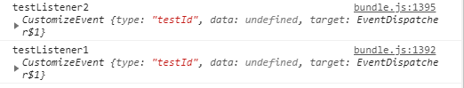

# EventMgr

功能支持监听、发送消息，支持中断 支持优先级

## 监听消息  
消息都是只能在EventDispatcher对象或者派生对象 上监听
` on(type: string, listener: Function, caller: any, priority?: number, once?: boolean) `
>  参数说明：
>  type：消息类型
>  listener：监听函数
>  caller：监听对象
>  priority：监听优先级 越大越早收到（默认谁先添加谁在前面）
>  once：是否只监听一次

` once(type: string, listener: Function, caller: any, priority?: number) `
> 和 on参数一样只是吧once固定了

----------------------------------------------------------------------------------------------------------

## 取消监听

`off(type: string, listener: Function, caller: any)`
> 参数说明：
>  type：消息类型
 >listener：监听函数
>  caller：监听对象

` offAll(type?: string) `
> 取消所有这个消息的监听
> 参数说明:
> type: 消息类型

` offAllCaller(caller: any) `
>取消某个对象上监听的所有消息
>参数说明:
>caller:对象

-----------------------------------------------------------------------------------------------------

## 发送消息
发送消息也是一样 只能使用EventDispatcher对象或者派生对象进行发送
发送出的消息只能是监听在这个对象上的才能收到

### 使用event对象进行消息发送
`dispatchEvent(ev: Event)`
>参数说明:
>ev:消息要派发的内容

### 使用消息类型和需要发送的对象进行发送
` dispatchEventWith(type: string, data?: any) `

> 参数说明:
> type: 消息类型
> data:要附加的参数

----------------------------------------------------------------------------
## event类说明

主要用于消息传递可以自己继承
参数说明:
> type:消息类型
> data:传递消息附带的数据
> stopImmediatePropagation(): 终止消息继续传递
>create() :调用这个来构建一个消息类型使用这个可以支持对象池

-----------------------------------------------------------------------------

案例:

```typescript
import * as YK from "./../../YK/YK"

export class EventTest {
    private static eventDis: EventDispatcher;

    static test() {
        this.eventDis = new EventDispatcher();
        this.testListener();
        this.testSend();
    }

    static testListener() {
        this.eventDis.on(CustomizeEvent.testId, this.testListener1, this, 1);
        this.eventDis.on(CustomizeEvent.testId, this.testListener2, this, 2);

    }

    static testSend() {
        Laya.timer.loop(1000, this, () => {
            let ev = YK.Event.create(CustomizeEvent, CustomizeEvent.testId);
            this.eventDis.dispatchEvent(ev);
        });
    }

    static testListener1(ev: YK.Event) {
        console.log("testListener1", ev)
    }

    static testListener2(ev: YK.Event) {
        console.log("testListener2", ev)
    }
}

export class CustomizeEvent extends YK.Event {
    static testId = "testId";
}

export class EventDispatcher extends YK.EventDispatcher {

}
```

