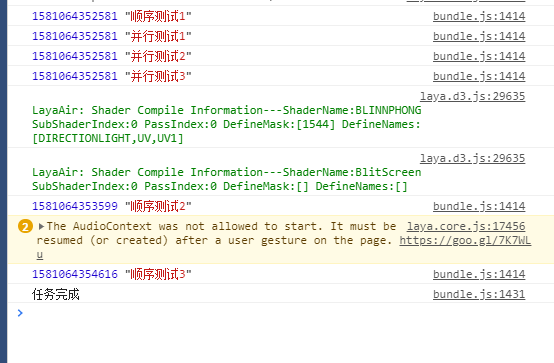

# Task

任务模块主要用于执行一些特定任务，支持并行和顺序执行，支持任务无限嵌套

使用例子：

```typescript
import * as YK from "../../YK/YK";
class LogTask extends YK.Task {
    private readonly log: string;

    constructor(log: string) {
        super();
        this.log = log;
    }

    protected onExecute() {
        super.onExecute();
        Laya.timer.once(1000, this, () => {
            this.endAction(true);
        });
        console.log(Laya.timer.currTimer, this.log);
    }
}

export class TaskTest {
    static test() {
        let parallel = new YK.TaskList(YK.ActionsExecutionMode.RunInParallel);
        let sequence = new YK.TaskList(YK.ActionsExecutionMode.RunInSequence);
        sequence.addTask(new LogTask("顺序测试1"))
            .addTask(new LogTask("顺序测试2"))
            .addTask(new LogTask("顺序测试3"));

        parallel.addTask(new LogTask("并行测试1"))
            .addTask(new LogTask("并行测试2"))
            .addTask(new LogTask("并行测试3"));

        let task = new YK.TaskList(YK.ActionsExecutionMode.RunInParallel)
            .addTask(sequence)
            .addTask(parallel)
            .execute(null, Laya.Handler.create(this, () => {
                console.log("任务完成");
            }));
    }
}
```

运行效果：

